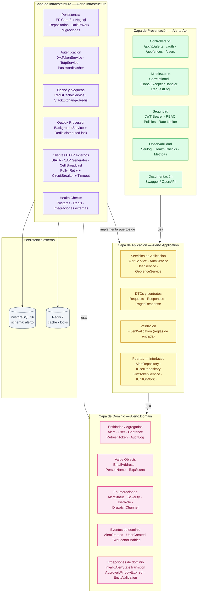
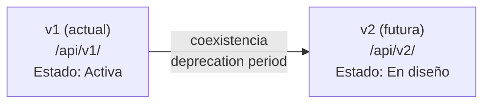
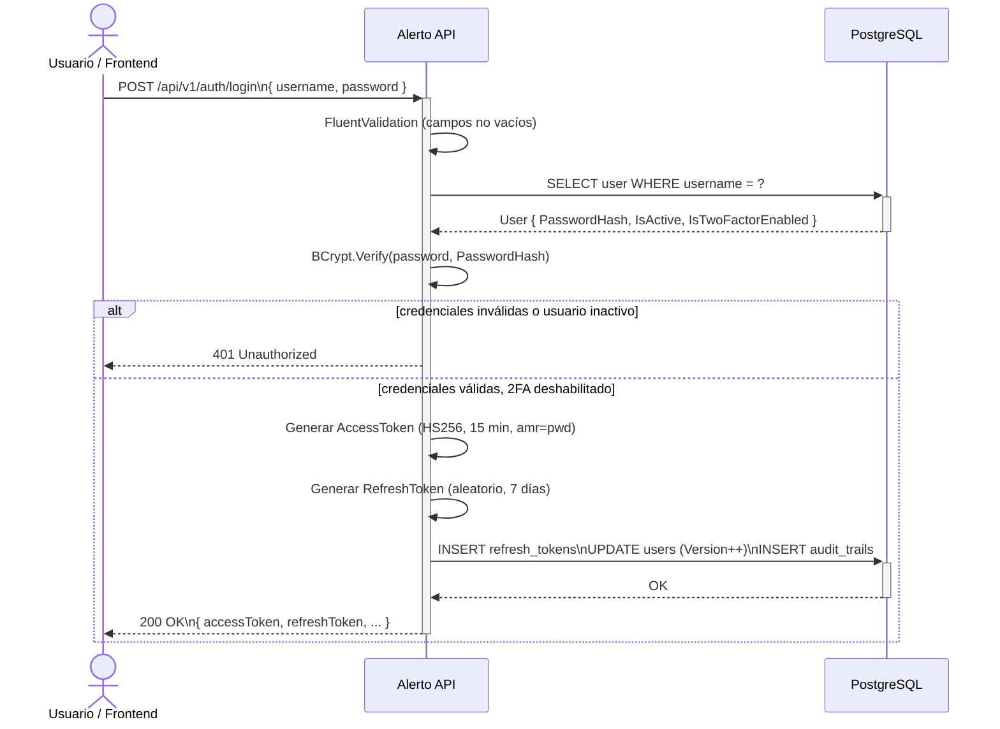
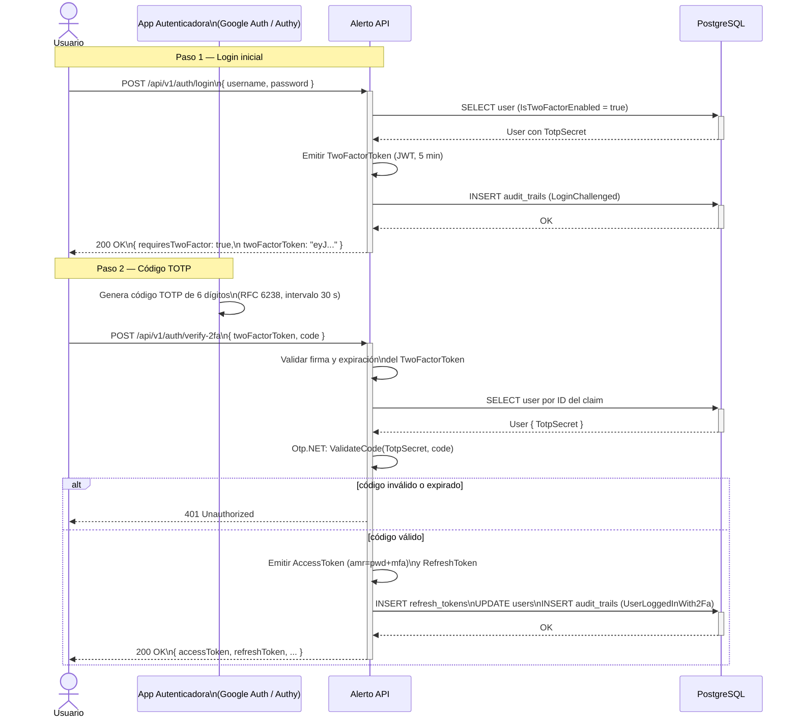
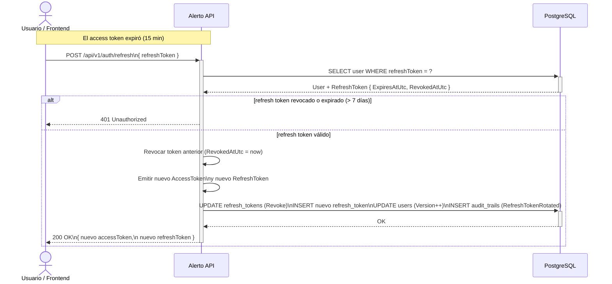
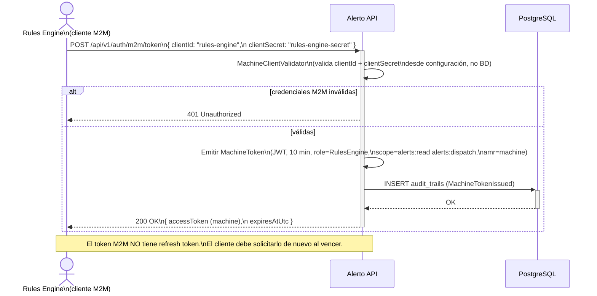

# Actividad 4 — Planteamiento y Definición del Proyecto

**Asignatura:** Computación Orientada a Servicios — ING01217  
**Institución:** Politécnico Colombiano Jaime Isaza Cadavid  
**Docente:** Andres Felipe González Orozco  
**Estudiantes:** Federico Bayer Cuartas · Rafael Estiven Uribe Álvarez  
**Fecha:** 14/04/2026

---

## Tabla de contenido

1. [Diagrama de arquitectura en capas](#1-diagrama-de-arquitectura-en-capas)
2. [Versionamiento definido — `/api/v1/`](#2-versionamiento-definido--apiv1)
3. [Estructura del proyecto propuesta](#3-estructura-del-proyecto-propuesta)
4. [Diseño formal de contratos de endpoints](#4-diseño-formal-de-contratos-de-endpoints)
5. [Diseño preliminar del flujo JWT](#5-diseño-preliminar-del-flujo-jwt)

---

## 1. Diagrama de arquitectura en capas

La solución adopta **Clean Architecture** sobre cuatro capas concéntricas, donde la dependencia siempre apunta hacia el interior. La capa de dominio no conoce nada de infraestructura ni de presentación.

### 1.1 Capas y responsabilidades



### 1.2 Regla de dependencia

| Capa origen | Puede depender de | No puede depender de |
|---|---|---|
| `Alerto.Api` | `Application`, `Infrastructure` | — |
| `Alerto.Application` | `Domain` | `Infrastructure`, `Api` |
| `Alerto.Domain` | — (sin dependencias) | `Application`, `Infrastructure`, `Api` |
| `Alerto.Infrastructure` | `Application`, `Domain` | `Api` |

La inversión de dependencias se logra mediante interfaces (puertos) definidas en `Application` e implementadas en `Infrastructure`. Por ejemplo, `IAlertRepository` vive en `Application`; `AlertRepository` (EF Core) vive en `Infrastructure`.

---

## 2. Versionamiento definido — `/api/v1/`

### 2.1 Estrategia adoptada

Se utiliza **versionamiento por segmento de URL** (`UrlSegmentApiVersionReader`), que expone la versión de forma explícita y legible en la ruta:

```
https://{host}/api/v{version}/{recurso}
```

Ejemplos concretos:

```
GET  /api/v1/alerts
POST /api/v1/alerts/{id}/approve
POST /api/v1/auth/login
GET  /api/v1/geofences
```

### 2.2 Configuración en ASP.NET Core

```csharp
// Program.cs
builder.Services.AddApiVersioning(options =>
{
    options.DefaultApiVersion = new ApiVersion(1, 0);
    options.AssumeDefaultVersionWhenUnspecified = true;
    options.ReportApiVersions = true;
    options.ApiVersionReader = new UrlSegmentApiVersionReader();
})
.AddApiExplorer(options =>
{
    options.GroupNameFormat    = "'v'V";
    options.SubstituteApiVersionInUrl = true;
});
```

### 2.3 Declaración en controladores

```csharp
[ApiController]
[ApiVersion("1.0")]
[Route("api/v{version:apiVersion}/alerts")]
public sealed class AlertsController : ControllerBase { ... }
```

### 2.4 Justificación de la estrategia

| Criterio | Decisión |
|---|---|
| **Visibilidad** | La versión es visible en la URL, lo que facilita el diagnóstico y los logs |
| **Compatibilidad** | Múltiples versiones pueden coexistir sin romper clientes existentes |
| **Simplicidad** | No requiere cabeceras personalizadas ni negociación de contenido |
| **Evolución** | Una futura `v2` puede introducirse en paralelo sin afectar `v1` |
| **Documentación** | Swagger genera un grupo separado por versión automáticamente |

### 2.5 Plan de evolución de versiones



Cuando se introduzca `v2`, `v1` se mantendrá disponible con un periodo de deprecación comunicado mediante la cabecera `api-deprecated-versions` que ASP.NET API Versioning añade automáticamente.

---

## 3. Estructura del proyecto propuesta

### 3.1 Árbol de directorios

```
Alerto/
├── Alerto.sln
│
├── src/
│   ├── Alerto.Api/                          # Capa de Presentación
│   │   ├── Controllers/
│   │   │   └── V1/
│   │   │       ├── AlertsController.cs
│   │   │       ├── AuthController.cs
│   │   │       ├── GeofencesController.cs
│   │   │       └── UsersController.cs
│   │   ├── Extensions/
│   │   ├── HealthChecks/
│   │   ├── Middlewares/
│   │   │   ├── CorrelationIdMiddleware.cs
│   │   │   ├── GlobalExceptionHandlingMiddleware.cs
│   │   │   └── RequestResponseLoggingMiddleware.cs
│   │   ├── Observability/
│   │   ├── OpenApi/
│   │   ├── Security/
│   │   │   └── AuthPolicies.cs
│   │   ├── appsettings.json
│   │   └── Program.cs
│   │
│   ├── Alerto.Application/                  # Capa de Aplicación
│   │   ├── Alerts/
│   │   │   ├── AlertContracts.cs            # DTOs de alertas
│   │   │   ├── AlertService.cs
│   │   │   ├── AlertValidators.cs
│   │   │   └── IAlertService.cs
│   │   ├── Auth/
│   │   │   ├── AuthContracts.cs             # DTOs de autenticación
│   │   │   ├── AuthService.cs
│   │   │   ├── AuthValidators.cs
│   │   │   └── IAuthService.cs
│   │   ├── Geofences/
│   │   ├── Users/
│   │   └── Common/
│   │       ├── Exceptions/
│   │       │   ├── ConflictException.cs
│   │       │   ├── NotFoundException.cs
│   │       │   └── UnprocessableException.cs
│   │       ├── Interfaces/
│   │       │   ├── IPersistence.cs          # IAlertRepository, IUserRepository, ...
│   │       │   ├── IAuthServices.cs         # IJwtTokenService, IPasswordHasher, ...
│   │       │   ├── IClock.cs
│   │       │   └── ICurrentUserService.cs
│   │       └── Models/
│   │           └── PagedResponse.cs
│   │
│   ├── Alerto.Domain/                       # Capa de Dominio
│   │   ├── Common/
│   │   │   ├── BaseEntity.cs
│   │   │   └── DomainEvent.cs
│   │   ├── Entities/
│   │   │   ├── Alert.cs
│   │   │   ├── AlertDispatch.cs
│   │   │   ├── ApprovalRecord.cs
│   │   │   ├── AuditLog.cs
│   │   │   ├── Geofence.cs
│   │   │   ├── RefreshToken.cs
│   │   │   └── User.cs
│   │   ├── Enums/
│   │   │   ├── AlertStatus.cs
│   │   │   ├── DispatchChannel.cs
│   │   │   ├── Severity.cs
│   │   │   └── UserRole.cs
│   │   ├── Events/
│   │   ├── Exceptions/
│   │   │   ├── ApprovalWindowExpiredException.cs
│   │   │   ├── EntityValidationException.cs
│   │   │   ├── InvalidAlertStateTransitionException.cs
│   │   │   └── ...
│   │   └── ValueObjects/
│   │       ├── EmailAddress.cs
│   │       ├── PersonName.cs
│   │       └── TotpSecret.cs
│   │
│   └── Alerto.Infrastructure/               # Capa de Infraestructura
│       ├── Authentication/
│       │   ├── JwtTokenService.cs
│       │   ├── PasswordHasherAdapter.cs
│       │   └── TotpService.cs
│       ├── Caching/
│       │   └── RedisCacheService.cs
│       ├── Integrations/
│       │   ├── Cap/
│       │   ├── Dispatch/
│       │   ├── Publishing/
│       │   │   └── OutboxProcessorHostedService.cs
│       │   └── Siata/
│       ├── Persistence/
│       │   ├── Migrations/
│       │   ├── Outbox/
│       │   │   └── OutboxMessage.cs
│       │   ├── Repositories/
│       │   │   ├── AlertRepository.cs
│       │   │   ├── AuditTrailRepository.cs
│       │   │   ├── GeofenceRepository.cs
│       │   │   ├── UnitOfWork.cs
│       │   │   └── UserRepository.cs
│       │   ├── AlertoDbContext.cs
│       │   ├── AlertoDbContextFactory.cs    # IDesignTimeDbContextFactory
│       │   └── AlertoDbInitializer.cs
│       ├── Services/
│       └── DependencyInjection.cs
│
├── tests/
│   └── Alerto.DomainTests/                  # Pruebas unitarias del dominio
│       ├── AlertTests.cs                    # 22 tests
│       ├── GeofenceTests.cs                 # 8 tests
│       └── UserTests.cs                     # 13 tests
│
└── docker-compose.yml                       # PostgreSQL 16 + Redis 7
```

### 3.2 Justificación de la estructura

| Decisión | Razón |
|---|---|
| Un proyecto por capa | Garantiza que el compilador verifique los límites de dependencia |
| Carpetas por capacidad dentro de `Application` | Cohesión alta: `Alerts/`, `Auth/`, `Users/`, `Geofences/` agrupan contratos, servicio y validadores |
| `Common/Interfaces/` en `Application` | Los puertos viven donde se definen los casos de uso, no donde se implementan |
| `Migrations/` dentro de `Infrastructure` | El conocimiento del esquema relacional no debe salir de la infraestructura |
| `V1/` dentro de `Controllers/` | Facilita la adición futura de `V2/` sin refactorización mayor |

---

## 4. Diseño formal de contratos de endpoints

Los contratos se presentan siguiendo la especificación **OpenAPI 3.0**, incluyendo método, ruta, autorización, cuerpo, respuestas y ejemplos.

---

### 4.1 Endpoint: Autenticar usuario

#### Resumen

| Campo | Valor |
|---|---|
| **Método** | `POST` |
| **Ruta** | `/api/v1/auth/login` |
| **Versión** | v1 |
| **Autenticación** | No requerida (público) |
| **Política RBAC** | `[AllowAnonymous]` |
| **Rate Limit** | 20 req / 60 s por IP (ventana auth) |
| **Descripción** | Autentica un usuario con credenciales locales. Si tiene 2FA habilitado, retorna un ticket temporal para completar la verificación. Si no, retorna acceso completo con access token y refresh token. |

#### Request body — `application/json`

```json
{
  "username": "admin",
  "password": "AlertoAdmin123!"
}
```

| Campo | Tipo | Obligatorio | Restricciones |
|---|---|---|---|
| `username` | `string` | Sí | 1–80 caracteres, no vacío |
| `password` | `string` | Sí | 1–200 caracteres, no vacío |

#### Respuestas

**`200 OK` — Sesión emitida (sin 2FA)**

```json
{
  "tokenType": "Bearer",
  "username": "admin",
  "role": "Admin",
  "requiresTwoFactor": false,
  "accessToken": "eyJhbGciOiJIUzI1NiIsInR5cCI6IkpXVCJ9...",
  "accessTokenExpiresAtUtc": "2026-04-21T23:49:37Z",
  "refreshToken": "fqj8rsFoStznoofoZDLOjOdLqNque1qn...",
  "refreshTokenExpiresAtUtc": "2026-04-28T23:34:37Z",
  "twoFactorToken": null,
  "twoFactorTokenExpiresAtUtc": null
}
```

**`200 OK` — Desafío 2FA activo**

```json
{
  "tokenType": "Bearer",
  "username": "admin",
  "role": "Admin",
  "requiresTwoFactor": true,
  "accessToken": null,
  "accessTokenExpiresAtUtc": null,
  "refreshToken": null,
  "refreshTokenExpiresAtUtc": null,
  "twoFactorToken": "eyJhbGciOiJIUzI1NiIsInR5cCI6IkpXVCJ9...",
  "twoFactorTokenExpiresAtUtc": "2026-04-21T23:19:37Z"
}
```

**`400 Bad Request` — Datos de entrada inválidos**

```json
{
  "type": "about:blank",
  "title": "One or more validation errors occurred.",
  "status": 400,
  "errors": {
    "Username": ["'Username' must not be empty."]
  },
  "traceId": "0HN..."
}
```

**`401 Unauthorized` — Credenciales incorrectas o usuario inactivo**

```json
{
  "type": "about:blank",
  "title": "Unauthorized",
  "status": 401,
  "detail": "Credenciales invalidas.",
  "instance": "/api/v1/auth/login",
  "traceId": "0HN..."
}
```

**`429 Too Many Requests` — Rate limit excedido**

```json
{
  "type": "about:blank",
  "title": "Too Many Requests",
  "status": 429,
  "detail": "Se excedio el limite de solicitudes permitido para este cliente.",
  "instance": "/api/v1/auth/login",
  "traceId": "0HN..."
}
```

#### Esquema del campo `AuthenticationResponse`

```yaml
AuthenticationResponse:
  type: object
  properties:
    tokenType:
      type: string
      example: Bearer
    username:
      type: string
    role:
      type: string
      enum: [Admin, Operator, Analyst, Auditor, RulesEngine]
    requiresTwoFactor:
      type: boolean
    accessToken:
      type: string
      nullable: true
    accessTokenExpiresAtUtc:
      type: string
      format: date-time
      nullable: true
    refreshToken:
      type: string
      nullable: true
    refreshTokenExpiresAtUtc:
      type: string
      format: date-time
      nullable: true
    twoFactorToken:
      type: string
      nullable: true
    twoFactorTokenExpiresAtUtc:
      type: string
      format: date-time
      nullable: true
```

---

### 4.2 Endpoint: Crear alerta

#### Resumen

| Campo | Valor |
|---|---|
| **Método** | `POST` |
| **Ruta** | `/api/v1/alerts` |
| **Versión** | v1 |
| **Autenticación** | `Bearer {accessToken}` |
| **Política RBAC** | `AlertOperators` → roles `Admin`, `Operator` |
| **Rate Limit** | 120 req / 60 s por usuario autenticado |
| **Descripción** | Crea una nueva alerta en estado `Pending`. La alerta queda pendiente de aprobación manual durante un máximo de 3 minutos desde su creación (`ApprovalDeadlineUtc`). Requiere que la geocerca referenciada exista y esté activa. |

#### Request body — `application/json`

```json
{
  "title": "Creciente súbita río Medellín",
  "description": "Se detecta aumento acelerado del caudal con riesgo para sectores ribereños.",
  "severity": "Critical",
  "sourceSystem": "Tablero COE",
  "address": "Av. Regional con Calle 30, Medellín",
  "latitude": 6.230145,
  "longitude": -75.573921,
  "geofenceId": "3fa85f64-5717-4562-b3fc-2c963f66afa6"
}
```

| Campo | Tipo | Obligatorio | Restricciones |
|---|---|---|---|
| `title` | `string` | Sí | 1–160 caracteres |
| `description` | `string` | Sí | 1–2000 caracteres |
| `severity` | `enum` | Sí | `Minor`, `Moderate`, `Severe`, `Extreme`, `Critical` |
| `sourceSystem` | `string` | Sí | 1–80 caracteres |
| `address` | `string` | Sí | 1–200 caracteres |
| `latitude` | `decimal` | Sí | Precisión 9,6 — rango válido para Colombia |
| `longitude` | `decimal` | Sí | Precisión 9,6 — rango válido para Colombia |
| `geofenceId` | `uuid` | Sí | Geocerca existente y activa |

#### Respuestas

**`201 Created` — Alerta creada exitosamente**

```json
{
  "id": "d290f1ee-6c54-4b01-90e6-d701748f0851",
  "title": "Creciente súbita río Medellín",
  "description": "Se detecta aumento acelerado del caudal con riesgo para sectores ribereños.",
  "severity": "Critical",
  "status": "Pending",
  "sourceSystem": "Tablero COE",
  "address": "Av. Regional con Calle 30, Medellín",
  "latitude": 6.230145,
  "longitude": -75.573921,
  "geofenceId": "3fa85f64-5717-4562-b3fc-2c963f66afa6",
  "createdByUserId": "ec9cde3a-5f26-477a-b272-03dfc38e87c1",
  "approvedByUserId": null,
  "createdAtUtc": "2026-04-21T23:00:00Z",
  "updatedAtUtc": "2026-04-21T23:00:00Z",
  "approvalDeadlineUtc": "2026-04-21T23:03:00Z",
  "version": 0,
  "dispatches": []
}
```

> `Location: /api/v1/alerts/d290f1ee-6c54-4b01-90e6-d701748f0851`

**`400 Bad Request` — Validación fallida**

```json
{
  "type": "about:blank",
  "title": "One or more validation errors occurred.",
  "status": 400,
  "errors": {
    "Title": ["'Title' must not be empty."],
    "Severity": ["'Severity' tiene un valor inválido: 'Desconocido'."]
  },
  "traceId": "0HN..."
}
```

**`401 Unauthorized` — Token ausente o expirado**

```json
{
  "type": "about:blank",
  "title": "Unauthorized",
  "status": 401,
  "detail": "Se requiere un Bearer token valido para acceder al recurso.",
  "instance": "/api/v1/alerts",
  "traceId": "0HN..."
}
```

**`403 Forbidden` — Rol insuficiente (p.ej. `Auditor` intentando crear)**

```json
{
  "type": "about:blank",
  "title": "Forbidden",
  "status": 403,
  "detail": "El usuario autenticado no tiene permisos suficientes para esta operacion.",
  "instance": "/api/v1/alerts",
  "traceId": "0HN..."
}
```

**`404 Not Found` — Geocerca no existe o está inactiva**

```json
{
  "type": "about:blank",
  "title": "Not Found",
  "status": 404,
  "detail": "La geocerca especificada no existe o no está activa.",
  "instance": "/api/v1/alerts",
  "traceId": "0HN..."
}
```

#### Esquema del campo `AlertResponse`

```yaml
AlertResponse:
  type: object
  properties:
    id:
      type: string
      format: uuid
    title:
      type: string
    description:
      type: string
    severity:
      type: string
      enum: [Minor, Moderate, Severe, Extreme, Critical]
    status:
      type: string
      enum: [Pending, Approved, Rejected, Cancelled, Broadcasted]
    sourceSystem:
      type: string
    address:
      type: string
    latitude:
      type: number
      format: decimal
    longitude:
      type: number
      format: decimal
    geofenceId:
      type: string
      format: uuid
    createdByUserId:
      type: string
      format: uuid
    approvedByUserId:
      type: string
      format: uuid
      nullable: true
    createdAtUtc:
      type: string
      format: date-time
    updatedAtUtc:
      type: string
      format: date-time
    approvalDeadlineUtc:
      type: string
      format: date-time
    version:
      type: integer
      description: Token de concurrencia optimista. Enviar en ExpectedVersion al modificar.
    dispatches:
      type: array
      items:
        $ref: '#/components/schemas/AlertDispatchResponse'
```

---

### 4.3 Endpoint adicional: Aprobar alerta (bonus — demuestra reglas de negocio)

| Campo | Valor |
|---|---|
| **Método** | `POST` |
| **Ruta** | `/api/v1/alerts/{id}/approve` |
| **Autenticación** | `Bearer {accessToken}` |
| **Política RBAC** | `AlertApprovers` → roles `Admin`, `Analyst` |
| **Descripción** | Aprueba una alerta en estado `Pending` dentro de la ventana de 3 minutos. Usa concurrencia optimista mediante `expectedVersion`. |

#### Request body

```json
{
  "expectedVersion": 0
}
```

#### Reglas de negocio que aplican

| Condición | Respuesta |
|---|---|
| Alerta no existe | `404 Not Found` |
| `expectedVersion` no coincide con `Version` en BD | `409 Conflict` |
| Alerta no está en estado `Pending` | `422 Unprocessable Entity` |
| Ventana de aprobación vencida (> 3 min) | `422 Unprocessable Entity` |
| Todo correcto | `200 OK` con alerta en estado `Approved` |

---

## 5. Diseño preliminar del flujo JWT

### 5.1 Estructura del token JWT

El token emitido sigue el estándar **RFC 7519**. Tiene tres partes separadas por puntos: `header.payload.signature`.

#### Header

```json
{
  "alg": "HS256",
  "typ": "JWT"
}
```

#### Payload (claims del access token de usuario)

```json
{
  "sub":  "ec9cde3a-5f26-477a-b272-03dfc38e87c1",
  "http://schemas.xmlsoap.org/ws/2005/05/identity/claims/nameidentifier": "ec9cde3a-...",
  "unique_name": "admin",
  "http://schemas.xmlsoap.org/ws/2005/05/identity/claims/name": "admin",
  "http://schemas.microsoft.com/ws/2008/06/identity/claims/role": "Admin",
  "jti": "60b4f508471042 10a4c5ea901a32ba2a",
  "amr": "pwd",
  "exp": 1776815377,
  "iss": "alerto-api",
  "aud": "alerto-clients"
}
```

| Claim | Significado |
|---|---|
| `sub` | ID único del usuario (UUID) |
| `unique_name` | Nombre de usuario (username) |
| `role` | Rol del usuario: `Admin`, `Operator`, `Analyst`, `Auditor`, `RulesEngine` |
| `jti` | ID único del token (para revocación futura) |
| `amr` | Método de autenticación: `pwd`, `pwd+mfa`, `refresh`, `machine` |
| `exp` | Unix timestamp de expiración |
| `iss` | Emisor: `alerto-api` |
| `aud` | Audiencia: `alerto-clients` |

#### Signature

```
HMAC-SHA256(
  base64url(header) + "." + base64url(payload),
  secretKey
)
```

La clave secreta (`Jwt:SecretKey`) se carga desde configuración y debe sobrescribirse con una cadena criptográficamente segura en producción. La app lanza excepción en startup si detecta el valor de desarrollo en ambiente productivo.

### 5.2 Tipos de token emitidos

| Tipo | Vida útil | Propósito | `amr` |
|---|---|---|---|
| **Access Token** (usuario) | 15 min | Autoriza peticiones HTTP del usuario | `pwd` o `pwd+mfa` o `refresh` |
| **Refresh Token** | 7 días | Rota la sesión sin re-login | — (persiste en BD) |
| **Two-Factor Token** | 5 min | Ticket temporal para completar 2FA | — |
| **Machine Token** | 10 min | Acceso M2M para Rules Engine u otros clientes | `machine` |

### 5.3 Flujo 1 — Autenticación estándar (sin 2FA)



### 5.4 Flujo 2 — Autenticación con 2FA (TOTP)



### 5.5 Flujo 3 — Rotación de refresh token



### 5.6 Flujo 4 — Autenticación M2M (máquina a máquina)



### 5.7 Configuración de seguridad JWT

```json
{
  "Jwt": {
    "Issuer": "alerto-api",
    "Audience": "alerto-clients",
    "SecretKey": "*** sobrescribir en producción ***",
    "AccessTokenMinutes": 15,
    "TwoFactorTokenMinutes": 5,
    "MachineTokenMinutes": 10
  }
}
```

### 5.8 Matriz de roles y accesos

| Política | Admin | Operator | Analyst | Auditor | RulesEngine |
|---|:---:|:---:|:---:|:---:|:---:|
| `AlertReaders` (leer alertas) | ✓ | ✓ | ✓ | ✓ | ✓ |
| `AlertOperators` (crear/editar) | ✓ | ✓ | — | — | — |
| `AlertApprovers` (aprobar/rechazar) | ✓ | — | ✓ | — | — |
| `Dispatchers` (difundir) | ✓ | — | ✓ | — | ✓ |
| `GeofenceReaders` | ✓ | ✓ | ✓ | ✓ | ✓ |
| `GeofenceManagers` (crear/editar) | ✓ | — | — | — | — |
| `UserAdministrators` | ✓ | — | — | — | — |
| `AdminsOnly` | ✓ | — | — | — | — |

---

*Documento generado como parte de la Actividad 4 — Planteamiento y Definición del Proyecto.*  
*Politécnico Colombiano Jaime Isaza Cadavid · Ingeniería Informática · ING01217 · 2026-1*
