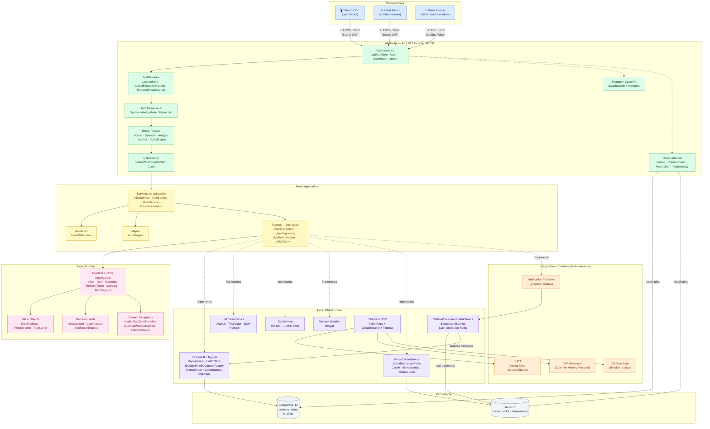

# Alerto Management API

API RESTful versionada en .NET 8 para la gestión integral de alertas civiles georreferenciadas en Medellín, diseñada como solución académica-profesional para la asignatura **Computación Orientada a Servicios**.

## Información académica

| Campo | Detalle |
|---|---|
| **Institución** | Politécnico Colombiano Jaime Isaza Cadavid |
| **Facultad** | Facultad de Ingeniería |
| **Programa** | Ingeniería Informática |
| **Asignatura** | Computación Orientada a Servicios — ING01217 |
| **Docente** | Andres Felipe González Orozco |
| **Actividad** | 4 — Planteamiento y Definición del Proyecto |
| **Fecha** | 14/04/2026 |
| **Estudiantes** | Federico Bayer Cuartas · Rafael Estiven Uribe Álvarez |

## Resumen ejecutivo

`Alerto Management API` resuelve un problema real de coordinación operativa: centralizar la creación, validación, aprobación, difusión y trazabilidad de alertas civiles para múltiples consumidores. La solución no se plantea como un CRUD genérico, sino como un servicio orientado a capacidades de negocio concretas:

- Backend for Frontend para un Tablero COE.
- Backend para un Panel de Administración.
- Servicio reutilizable para integraciones M2M con un Rules Engine.
- Núcleo transaccional para seguridad, geocercas, auditoría y observabilidad.

El proyecto demuestra principios de SOA sobre un **modular monolith con Clean Architecture**, priorizando contrato estable, interoperabilidad, desacoplamiento y evolución controlada.

## Contexto del problema

En un escenario de gestión de emergencias o alertamiento temprano, no basta con almacenar registros. Se requiere:

- representar alertas con estados y reglas explícitas;
- restringir quién puede crearlas, aprobarlas o cancelarlas;
- asociarlas a zonas geográficas operativas;
- dejar evidencia auditable de cada acción crítica;
- integrarse con otros sistemas institucionales;
- exponer una API consistente para clientes humanos y máquina a máquina.

En ese contexto, una API escolar básica de tipo CRUD sería insuficiente. `Alerto` incorpora reglas de negocio, seguridad, trazabilidad y adaptadores externos que la convierten en una solución alineada con un entorno institucional real.

## Relación con la asignatura "Computación Orientada a Servicios"

La solución responde directamente a la asignatura porque modela un servicio con las características esperadas en una arquitectura orientada a servicios:

- **contrato estable**: endpoints versionados en `/api/v1/`;
- **interoperabilidad**: HTTPS + JSON + JWT + OpenAPI;
- **reutilización**: un mismo servicio atiende frontend, panel administrativo e integraciones M2M;
- **desacoplamiento**: casos de uso y puertos separados de los adaptadores tecnológicos;
- **composición y evolución**: el servicio puede integrarse con SIATA, generación CAP, difusión Cell Broadcast y publicación de eventos;
- **observabilidad y gobierno**: health checks, auditoría, ProblemDetails, logging estructurado y documentación técnica.

En otras palabras, el proyecto implementa un servicio con propósito de negocio y diseño reusable, no un conjunto aislado de endpoints.

## Justificación del enfoque SOA

Se eligió un enfoque SOA porque el dominio de alertas requiere servir a consumidores heterogéneos sin acoplar la lógica a un cliente particular.

Beneficios concretos en esta solución:

- El Tablero COE consume consultas operativas y estados de alerta.
- El Panel de Administración consume módulos de usuarios y geocercas.
- El Rules Engine consume tokens M2M y puede integrarse con capacidades de lectura o difusión.
- Las integraciones externas se modelan por puertos y adaptadores, preservando independencia tecnológica.
- El versionamiento por ruta facilita evolución del contrato sin romper clientes existentes.

## Arquitectura de la solución

La solución adopta **Clean Architecture** en 4 capas y se despliega como **modular monolith**.

### Capas

- `Alerto.Api`
  - Controllers versionados.
  - Swagger/OpenAPI.
  - Middlewares.
  - Autenticación/autorización.
  - Observabilidad.

- `Alerto.Application`
  - Casos de uso.
  - DTOs.
  - Validaciones con FluentValidation.
  - Puertos/interfaces.
  - Reglas de aplicación.

- `Alerto.Domain`
  - Entidades.
  - Value Objects.
  - Enums.
  - Invariantes y reglas de negocio.

- `Alerto.Infrastructure`
  - EF Core y PostgreSQL.
  - Redis.
  - JWT, refresh tokens y TOTP.
  - Repositorios.
  - Integraciones externas.
  - Health checks y adaptadores.

### Dependencias

- `Api -> Application`
- `Api -> Infrastructure`
- `Application -> Domain`
- `Infrastructure -> Application`
- `Infrastructure -> Domain`

Dependencias prohibidas:

- `Domain -> Infrastructure`
- `Domain -> Api`
- `Application -> Infrastructure`

### Diagrama de arquitectura tecnológica



## Estructura de proyectos

```text
Alerto.sln
src/
  Alerto.Api/
  Alerto.Application/
  Alerto.Domain/
  Alerto.Infrastructure/
tests/
  Alerto.DomainTests/
docker-compose.yml
README.md
```

## Tecnologías usadas

| Categoría | Tecnología | Uso |
|---|---|---|
| Runtime | .NET 8 | Plataforma base (LTS) |
| Framework web | ASP.NET Core Web API | HTTP, routing, DI, middleware |
| Versionamiento | ASP.NET API Versioning | `/api/v1/` con `UrlSegmentApiVersionReader` |
| ORM | Entity Framework Core 8 | Persistencia, migraciones, concurrencia optimista |
| Base de datos | PostgreSQL 16 (Npgsql) | Almacenamiento relacional principal |
| Caché / locks | Redis 7 (StackExchange.Redis) | Caché distribuido, idempotencia, lock Outbox |
| Autenticación | JWT Bearer + Refresh Tokens | Sesiones de usuario y clientes M2M |
| 2FA | TOTP (Otp.NET — RFC 6238) | Segundo factor para usuarios administrativos |
| Contraseñas | BCrypt | Hash seguro de credenciales |
| Validación | FluentValidation | Validación de DTOs y requests |
| Mapeo | AutoMapper | Conversión entre entidades y DTOs |
| Logging | Serilog + RenderedCompactJsonFormatter | Logging estructurado con CorrelationId |
| Resiliencia HTTP | Polly | Retry, Circuit Breaker, Timeout para integraciones |
| Documentación | Swashbuckle (OpenAPI/Swagger) | Documentación interactiva con ejemplos |
| Rate Limiting | ASP.NET Core Rate Limiter | SlidingWindow por usuario/IP |
| Tests | xUnit + FluentAssertions | Pruebas unitarias del dominio |
| Contenedores | Docker Compose | PostgreSQL + Redis en desarrollo |

## Requisitos previos

- .NET SDK 8
- Docker Desktop o motor Docker compatible
- Puerto `5433` disponible para PostgreSQL (mapeado desde `5432` interno)
- Puerto `6379` disponible para Redis

Opcional:

- Postman o cliente HTTP
- Navegador para usar Swagger UI

## Cómo ejecutar el proyecto localmente

### 1. Levantar dependencias

El repositorio incluye un `docker-compose.yml` para PostgreSQL y Redis:

```bash
docker compose up -d
```

### 2. Restaurar y compilar

```bash
dotnet restore Alerto.sln
dotnet build Alerto.sln
```

### 3. Ejecutar la API

```bash
dotnet run --project src/Alerto.Api/Alerto.Api.csproj
```

### 4. Acceder a Swagger

En ambiente `Development`, la documentación queda disponible en:

```text
http://localhost:5070/swagger
```

La URL exacta puede variar según la configuración local de ASP.NET Core (ver consola al iniciar).

## Variables de entorno

La solución usa `appsettings.json` y `appsettings.{Environment}.json`, pero también puede configurarse con variables de entorno.

Variables recomendadas:

```bash
ASPNETCORE_ENVIRONMENT=Development
ConnectionStrings__AlertoDb=Host=localhost;Port=5433;Database=alerto_db;Username=postgres;Password=postgres
ConnectionStrings__Redis=localhost:6379,abortConnect=false
Jwt__Issuer=alerto-api
Jwt__Audience=alerto-clients
Jwt__SecretKey=Alerto.Super.Secret.Key.For.DotNet.8.Api.2026
BootstrapAdmin__Username=admin
BootstrapAdmin__DisplayName=Administrador Alerto
BootstrapAdmin__Email=admin@alerto.local
BootstrapAdmin__Password=AlertoAdmin123!
```

Ejemplo en PowerShell:

```powershell
$env:ASPNETCORE_ENVIRONMENT="Development"
$env:ConnectionStrings__AlertoDb="Host=localhost;Port=5433;Database=alerto_db;Username=postgres;Password=postgres"
$env:ConnectionStrings__Redis="localhost:6379,abortConnect=false"
dotnet run --project src/Alerto.Api/Alerto.Api.csproj
```

## Migraciones y base de datos

El arranque de la aplicación ejecuta automáticamente `MigrateAsync` a través de `AlertoDbInitializer`. Esto aplica todas las migraciones pendientes y siembra los datos iniciales si la base está vacía.

En el primer arranque se crean automáticamente:

- todas las tablas del esquema `alerto`;
- un usuario administrador bootstrap (`admin`);
- una geocerca de referencia para Medellín Centro.

Para regenerar la migración inicial de forma manual:

```bash
dotnet ef migrations add InitialCreate \
  --project src/Alerto.Infrastructure \
  --startup-project src/Alerto.Api

dotnet ef database update \
  --project src/Alerto.Infrastructure \
  --startup-project src/Alerto.Api
```

## Autenticación y 2FA

La API implementa:

- JWT Bearer para usuarios humanos;
- refresh tokens persistidos;
- autenticación M2M para clientes institucionales;
- segundo factor TOTP para usuarios administrativos.

### Credenciales bootstrap

- Usuario: `admin`
- Password: `AlertoAdmin123!`
- Cliente M2M: `rules-engine`
- Secret M2M: `rules-engine-secret`

### Flujo de autenticación humana

1. `POST /api/v1/auth/login`
2. Si `requiresTwoFactor=true`, completar `POST /api/v1/auth/verify-2fa`
3. Usar `Authorize` en Swagger con:

```text
Bearer {access_token}
```

### Flujo de 2FA

- `POST /api/v1/auth/2fa/setup`
- `POST /api/v1/auth/2fa/enable`

### Flujo M2M

- `POST /api/v1/auth/m2m/token`

## Endpoints principales

### Autenticación

- `POST /api/v1/auth/login`
- `POST /api/v1/auth/verify-2fa`
- `POST /api/v1/auth/refresh`
- `POST /api/v1/auth/logout`
- `POST /api/v1/auth/m2m/token`
- `POST /api/v1/auth/2fa/setup`
- `POST /api/v1/auth/2fa/enable`

### Alerts

- `GET /api/v1/alerts`
- `GET /api/v1/alerts/{id}`
- `POST /api/v1/alerts`
- `PUT /api/v1/alerts/{id}`
- `POST /api/v1/alerts/{id}/approve`
- `POST /api/v1/alerts/{id}/reject`
- `POST /api/v1/alerts/{id}/cancel`
- `POST /api/v1/alerts/{id}/dispatch`

### Geofences

- `GET /api/v1/geofences`
- `GET /api/v1/geofences/{id}`
- `POST /api/v1/geofences`
- `PUT /api/v1/geofences/{id}`
- `POST /api/v1/geofences/{id}/activate`
- `POST /api/v1/geofences/{id}/deactivate`

### Users

- `GET /api/v1/users`
- `GET /api/v1/users/{id}`
- `POST /api/v1/users`
- `PUT /api/v1/users/{id}`
- `POST /api/v1/users/{id}/activate`
- `POST /api/v1/users/{id}/deactivate`

### Observabilidad

- `GET /metrics/basic`
- `GET /health/live`
- `GET /health/ready`

## Reglas de negocio críticas

- Toda alerta nace en estado `Pending`.
- Solo alertas `Pending` pueden aprobarse o rechazarse.
- La aprobación vence a los `3 minutos` desde la creación.
- Solo alertas `Approved` o `Broadcasted` pueden difundirse.
- Las acciones críticas generan auditoría obligatoria.
- Se aplica concurrencia optimista mediante `Version`.
- Las geocercas no se borran físicamente; se activan o inactivan.
- Los usuarios no se borran físicamente; se activan o inactivan.
- La autenticación administrativa admite 2FA con TOTP.

Estas reglas muestran que la solución encapsula comportamiento de negocio y no solo persistencia de datos.

## Ejemplos de uso

### Login

```http
POST /api/v1/auth/login
Content-Type: application/json

{
  "username": "admin",
  "password": "AlertoAdmin123!"
}
```

### Crear alerta

```http
POST /api/v1/alerts
Authorization: Bearer {token}
Content-Type: application/json

{
  "title": "Creciente súbita río Medellín",
  "description": "Se detecta aumento acelerado del caudal con riesgo para sectores ribereños.",
  "severity": "Critical",
  "sourceSystem": "Tablero COE",
  "address": "Av. Regional con Calle 30, Medellín",
  "latitude": 6.230145,
  "longitude": -75.573921,
  "geofenceId": "11111111-1111-1111-1111-111111111111"
}
```

### Aprobar alerta

```http
POST /api/v1/alerts/{id}/approve
Authorization: Bearer {token}
Content-Type: application/json

{
  "expectedVersion": 0
}
```

### Crear geocerca

```http
POST /api/v1/geofences
Authorization: Bearer {token}
Content-Type: application/json

{
  "code": "MEDE-SUR-01",
  "name": "Corredor Rio Medellin Sur",
  "polygonWkt": "POLYGON((-75.58 6.21,-75.56 6.21,-75.56 6.23,-75.58 6.23,-75.58 6.21))",
  "neighborhood": "Guayabal"
}
```

### Crear usuario operativo

```http
POST /api/v1/users
Authorization: Bearer {token}
Content-Type: application/json

{
  "username": "operador.norte",
  "displayName": "Operador Norte",
  "email": "operador.norte@alerto.local",
  "password": "OperadorNorte2026!",
  "role": "Operator"
}
```

## Pruebas

### Ejecutar pruebas unitarias del dominio

```bash
dotnet test tests/Alerto.DomainTests/
```

### Alcance actual de pruebas

- `Alerto.DomainTests` — 43 tests unitarios
  - `AlertTests`: ciclo de vida completo (Create, Approve, Reject, Cancel, Dispatch, Version).
  - `GeofenceTests`: validaciones de creación y actualización.
  - `UserTests`: usuarios, 2FA, refresh tokens y perfil.

## Observabilidad y manejo de errores

La API incorpora capacidades que la acercan a un estándar profesional:

- `Serilog` con logging estructurado;
- `Correlation ID` por request;
- logging seguro de request/response sin exponer secretos;
- `ProblemDetails` RFC 7807;
- `GlobalExceptionHandlingMiddleware`;
- health checks para API, PostgreSQL, Redis y dependencias externas;
- métricas básicas en `/metrics/basic`;
- auditoría persistente para operaciones críticas;
- rate limiting configurable;
- configuración diferenciada por ambiente.

### Endpoints de salud

- `/health/live`
- `/health/ready`

### Formato de error

```json
{
  "type": "about:blank",
  "title": "Unauthorized",
  "status": 401,
  "detail": "Se requiere un Bearer token valido para acceder al recurso.",
  "instance": "/api/v1/auth/logout",
  "traceId": "0HN9J4I2Q0LAA:00000001"
}
```

## Decisiones arquitectónicas destacadas

- **.NET 8**
  - plataforma LTS, madura y adecuada para servicios HTTP de alto rendimiento.

- **Clean Architecture**
  - protege el dominio y evita acoplar reglas de negocio a framework o persistencia.

- **PostgreSQL**
  - robustez transaccional y posibilidad de evolución futura hacia capacidades geoespaciales más avanzadas.

- **Redis**
  - cache distribuido y apoyo a idempotencia/anti-duplicación.

- **JWT + Refresh Tokens + 2FA**
  - combinación adecuada para clientes humanos, clientes M2M y operaciones críticas.

- **ProblemDetails**
  - contrato uniforme de errores para consumo por frontend e integraciones.

- **Versionamiento por ruta**
  - claridad docente y control explícito de compatibilidad.

- **Puertos y adaptadores**
  - las integraciones externas se definen por interfaces en `Application` y se implementan en `Infrastructure`.

## Posibles mejoras futuras

- Incorporar OpenTelemetry y exportación de trazas/métricas.
- Implementar dashboards de operación.
- Conectar proveedores reales de SIATA, CAP y Cell Broadcast.
- Ampliar pruebas unitarias por caso de uso.
- Añadir consultas específicas de auditoría y reporting.
- Incorporar políticas más avanzadas de lockout y revocación global de sesiones.
- Integrar PostGIS si se requiere análisis geoespacial más rico.
- Agregar pruebas de integración con Testcontainers.
- Agregar pruebas de arquitectura con NetArchTest.

## Créditos y autores

Proyecto desarrollado como solución académica-profesional para la asignatura **Computación Orientada a Servicios** (ING01217), Actividad 4.

| Rol | Nombre |
|---|---|
| Estudiante | Federico Bayer Cuartas |
| Estudiante | Rafael Estiven Uribe Álvarez |
| Docente | Andres Felipe González Orozco |
| Institución | Politécnico Colombiano Jaime Isaza Cadavid |
| Programa | Ingeniería Informática |
| Semestre | 2026-1 |

## Aporte de la solución a los principios SOA

`Alerto Management API` aporta a los principios SOA de forma explícita:

- **Servicio con propósito de negocio**
  - no expone tablas; expone capacidades como aprobar alertas, difundir, activar geocercas y administrar usuarios.

- **Contrato estable y explícito**
  - la API está versionada en `/api/v1/` y documentada con OpenAPI.

- **Interoperabilidad**
  - usa estándares ampliamente adoptados: HTTP, JSON, JWT, ProblemDetails y Swagger.

- **Desacoplamiento**
  - los casos de uso dependen de puertos; la infraestructura implementa adaptadores intercambiables.

- **Reutilización**
  - la misma API atiende múltiples consumidores sin duplicar lógica por cliente.

- **Composición**
  - el servicio puede participar en flujos mayores junto con motores de reglas, difusión y proveedores externos.

- **Autonomía**
  - encapsula reglas del dominio de alertas, seguridad, auditoría y geocercas sin delegar su consistencia a clientes.

- **Gobernanza**
  - observabilidad, versionamiento, seguridad y documentación refuerzan el control del servicio como activo institucional.

Por estas razones, la solución sí responde a la asignatura y demuestra una implementación orientada a servicios, más allá de un CRUD académico sin contexto ni reglas de negocio.
