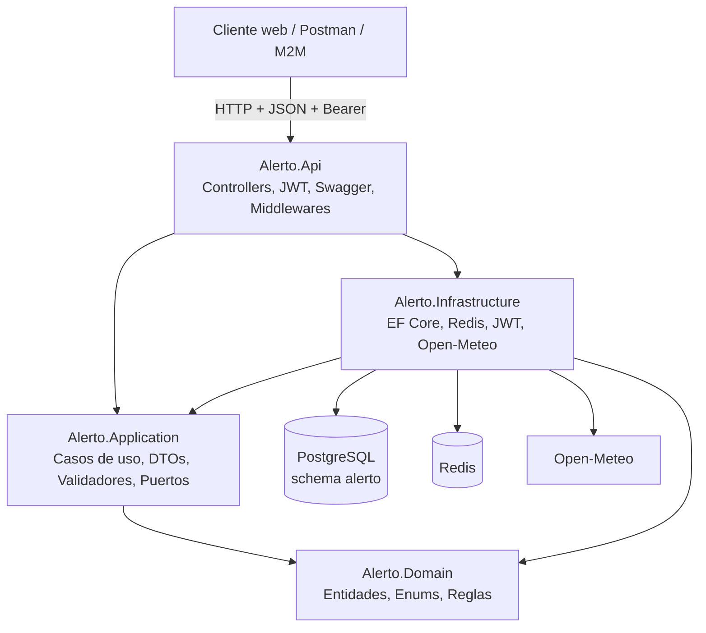

# Alerto Management API

API RESTful versionada en .NET 8 para la gestión de alertas civiles
georreferenciadas en Medellín. El proyecto combina autenticación JWT,
persistencia real en PostgreSQL, cache con Redis, CRUD completo, interfaz web
básica, consulta meteorológica con Open-Meteo y confirmaciones ciudadanas.

## Información académica

| Campo | Detalle |
|---|---|
| Institución | Politécnico Colombiano Jaime Isaza Cadavid |
| Facultad | Facultad de Ingeniería |
| Programa | Ingeniería Informática |
| Asignatura | Computación Orientada a Servicios |
| Docente | Andrés Felipe González Orozco |
| Estudiantes | Federico Bayer Cuartas - Rafael Estiven Uribe Alvarez |
| Repositorio | https://github.com/EstivenUribe/Alerto |

## Contexto funcional

Alerto resuelve una necesidad real de alertamiento temprano: registrar,
validar, aprobar, difundir y consultar alertas civiles sin perder trazabilidad.
La API no expone solo tablas; expone capacidades de negocio para operadores,
administradores, analistas, auditores, ciudadanos y clientes máquina a máquina.

Procesos soportados:

- Registro y consulta de alertas por zona geográfica.
- Reporte ciudadano de nuevas alertas pendientes de revisión.
- Aprobación, rechazo, cancelación y difusión de alertas.
- Borrado administrativo lógico de alertas, sin destruir registros históricos.
- Confirmación ciudadana de alertas aprobadas o difundidas.
- Consulta meteorológica por coordenadas con persistencia de lecturas.
- Creación automática de alertas cuando el riesgo por lluvia es alto o crítico.
- Administración de usuarios, roles y geocercas.
- Auditoría de acciones críticas.

## Principios SOA aplicados

- Contrato versionado: rutas bajo `/api/v1/`.
- Interoperabilidad: HTTP, JSON, JWT Bearer, ProblemDetails y Swagger/OpenAPI.
- Desacoplamiento: Clean Architecture con puertos e implementaciones separadas.
- Stateless: cada request se valida mediante token JWT.
- Reutilización: la misma API sirve a la interfaz web, Postman y clientes M2M.
- Gobernanza: logs, health checks, rate limiting, auditoría y manual técnico.

## Arquitectura



## Estructura del proyecto

```text
Alerto.sln
src/
  Alerto.Api/              API HTTP, Swagger, seguridad, frontend estático
  Alerto.Application/      Casos de uso, DTOs, validadores, puertos
  Alerto.Domain/           Entidades, enums, value objects, reglas
  Alerto.Infrastructure/   EF Core, PostgreSQL, Redis, JWT, Open-Meteo
tests/
  Alerto.DomainTests/
  Alerto.ArchitectureTests/
  Alerto.IntegrationTests/
Coleccion de Postman.postman_collection.json
CheckPoint 3. 28.04.26.md
docker-compose.yml
```

## Tecnologías

| Tecnología | Uso |
|---|---|
| .NET 8 / ASP.NET Core | API HTTP, DI, middlewares, seguridad |
| Entity Framework Core 8 | ORM, migraciones y concurrencia optimista |
| PostgreSQL 16 | Base de datos relacional principal |
| Redis 7 | Cache, locks e idempotencia |
| JWT Bearer | Autenticación stateless |
| Refresh tokens | Renovación controlada de sesiones |
| TOTP | Segundo factor para usuarios administrativos |
| FluentValidation | Validación de requests |
| AutoMapper | Mapeo entre entidades y DTOs |
| Serilog | Logging estructurado |
| Polly | Resiliencia para clientes HTTP externos |
| Open-Meteo | Datos meteorológicos reales |
| HTML, CSS y JavaScript | Interfaz básica conectada a la API |
| Leaflet | Mapas en la interfaz web |
| Assets institucionales | Logo Alerto e imagen de Facultad de Ingeniería en login y pie de página |
| xUnit | Pruebas de dominio, arquitectura e integración |
| Docker Compose | PostgreSQL y Redis en desarrollo |

## Requisitos previos

- .NET SDK 8
- Docker Desktop o motor Docker compatible
- Puerto `5433` disponible para PostgreSQL
- Puerto `6379` disponible para Redis
- Navegador web
- Postman, Thunder Client o cliente HTTP equivalente

## Ejecución local

1. Levantar dependencias:

```bash
docker compose up -d
```

2. Restaurar y compilar:

```bash
dotnet restore Alerto.sln
dotnet build Alerto.sln
```

3. Ejecutar la API:

```bash
dotnet run --project src/Alerto.Api/Alerto.Api.csproj --launch-profile http
```

4. Abrir la interfaz web:

```text
http://localhost:5070/
```

5. Abrir Swagger:

```text
http://localhost:5070/swagger
```

La URL exacta puede variar según el perfil de ejecución mostrado por la
consola.

## Configuración principal

La configuración base está en `src/Alerto.Api/appsettings.json` y puede
sobrescribirse con variables de entorno.

```bash
ASPNETCORE_ENVIRONMENT=Development
ConnectionStrings__AlertoDb=Host=localhost;Port=5433;Database=alerto_db;Username=postgres;Password=postgres
ConnectionStrings__Redis=localhost:6379,abortConnect=false
Jwt__Issuer=alerto-api
Jwt__Audience=alerto-clients
Jwt__SecretKey=Alerto.Super.Secret.Key.For.DotNet.8.Api.2026
BootstrapAdmin__Username=admin
BootstrapAdmin__DisplayName=Administrador Alerto
BootstrapAdmin__Email=admin@alerto.local
BootstrapAdmin__Password=AlertoAdmin123!
Integrations__OpenMeteo__BaseUrl=https://api.open-meteo.com/
```

## Base de datos y migraciones

Al iniciar, la API aplica migraciones pendientes mediante `AlertoDbInitializer`.
También verifica y crea datos demo cuando hacen falta:

- usuario administrador `admin`;
- usuario operador `operador`;
- usuario ciudadano `ciudadano`;
- geocerca de referencia;
- esquema `alerto` con tablas de usuarios, alertas, geocercas, auditoría,
  refresh tokens, outbox, lecturas meteorológicas y confirmaciones ciudadanas.

Comandos útiles:

```bash
dotnet ef migrations add NombreMigracion --project src/Alerto.Infrastructure --startup-project src/Alerto.Api
dotnet ef database update --project src/Alerto.Infrastructure --startup-project src/Alerto.Api
```

## Credenciales de prueba

Usuarios demo:

| Rol | Usuario | Password |
|---|---|---|
| Admin | `admin` | `AlertoAdmin123!` |
| Operator | `operador` | `Alerto2026!` |
| Citizen | `ciudadano` | `Alerto2026!` |

Cliente M2M:

```text
clientId: rules-engine
clientSecret: rules-engine-secret
```

## Roles y permisos

| Rol | Permisos principales |
|---|---|
| Admin | Gestión total, usuarios, geocercas y borrado administrativo de alertas |
| Operator | Crear, actualizar, aprobar, rechazar, cancelar y confirmar alertas |
| Analyst | Aprobar, rechazar, cancelar, difundir y consultar confirmaciones |
| Auditor | Consultar información operativa |
| Citizen | Consultar alertas/geocercas/clima, crear reportes y confirmar alertas activas |
| RulesEngine | Cliente M2M para lectura y difusión permitida |

## Endpoints principales

### Autenticación

- `POST /api/v1/auth/login`
- `POST /api/v1/auth/verify-2fa`
- `POST /api/v1/auth/refresh`
- `POST /api/v1/auth/logout`
- `POST /api/v1/auth/m2m/token`
- `POST /api/v1/auth/2fa/setup`
- `POST /api/v1/auth/2fa/enable`

### Alertas

- `GET /api/v1/alerts`
- `GET /api/v1/alerts/{id}`
- `POST /api/v1/alerts`
- `PUT /api/v1/alerts/{id}`
- `DELETE /api/v1/alerts/{id}`
- `POST /api/v1/alerts/{id}/approve`
- `POST /api/v1/alerts/{id}/reject`
- `POST /api/v1/alerts/{id}/cancel`
- `POST /api/v1/alerts/{id}/dispatch`
- `POST /api/v1/alerts/{id}/citizen-confirm`
- `GET /api/v1/alerts/{id}/citizen-confirmations`

### Meteorología

- `GET /api/v1/weather/dashboard?latitude={lat}&longitude={lon}`
- `GET /api/v1/weather/history?latitude={lat}&longitude={lon}&fromUtc={from}&toUtc={to}`

### Geocercas

- `GET /api/v1/geofences`
- `GET /api/v1/geofences/{id}`
- `POST /api/v1/geofences`
- `PUT /api/v1/geofences/{id}`
- `POST /api/v1/geofences/{id}/activate`
- `POST /api/v1/geofences/{id}/deactivate`

### Usuarios

- `GET /api/v1/users`
- `GET /api/v1/users/{id}`
- `POST /api/v1/users`
- `PUT /api/v1/users/{id}`
- `POST /api/v1/users/{id}/activate`
- `POST /api/v1/users/{id}/deactivate`

### Observabilidad

- `GET /metrics/basic`
- `GET /health/live`
- `GET /health/ready`

## Reglas de negocio relevantes

- Toda alerta nace en estado `Pending`.
- `Admin`, `Operator` y `Citizen` pueden crear alertas.
- Solo alertas `Pending` pueden aprobarse o rechazarse.
- La aprobación vence a los 3 minutos desde la creación.
- `Admin`, `Analyst` y `RulesEngine` pueden difundir alertas.
- Solo alertas `Approved` o `Broadcasted` pueden difundirse.
- Solo alertas `Approved` o `Broadcasted` pueden recibir confirmación ciudadana.
- Cada usuario puede confirmar una misma alerta una sola vez.
- Solo `Admin` puede eliminar administrativamente una alerta.
- La eliminación de alertas es lógica: se marca `IsDeleted`, no se borra la fila.
- Usuarios y geocercas se activan o inactivan; no se eliminan físicamente.
- Las lecturas de clima se persisten en base de datos.
- Riesgo meteorológico `High` o `Critical` puede generar una alerta automática.
- Se usa concurrencia optimista mediante `Version`.
- Las acciones críticas generan auditoría.

## Ejemplos HTTP

### Login

```http
POST /api/v1/auth/login
Content-Type: application/json

{
  "username": "admin",
  "password": "AlertoAdmin123!"
}
```

### Crear alerta

```http
POST /api/v1/alerts
Authorization: Bearer {token}
Content-Type: application/json

{
  "title": "Creciente súbita río Medellín",
  "description": "Se detecta aumento acelerado del caudal con riesgo para sectores ribereños.",
  "severity": "Critical",
  "sourceSystem": "Tablero COE",
  "address": "Av. Regional con Calle 30, Medellín",
  "latitude": 6.230145,
  "longitude": -75.573921,
  "geofenceId": "{geofenceId}"
}
```

### Eliminar administrativamente una alerta

```http
DELETE /api/v1/alerts/{id}
Authorization: Bearer {token-admin}
Content-Type: application/json

{
  "expectedVersion": 0,
  "reason": "Registro retirado por validación administrativa."
}
```

### Confirmar alerta

```http
POST /api/v1/alerts/{id}/citizen-confirm
Authorization: Bearer {token}
Content-Type: application/json

{
  "notes": "La situación fue confirmada en campo."
}
```

### Consultar clima

```http
GET /api/v1/weather/dashboard?latitude=6.244203&longitude=-75.581211
Authorization: Bearer {token}
Accept: application/json
```

## Interfaz web

La interfaz está servida por la misma API desde `src/Alerto.Api/wwwroot`.
Permite:

- iniciar sesión;
- usar accesos demo para `admin`, `operador` y `ciudadano`;
- visualizar el logo de Alerto en login y aplicación;
- mostrar pie institucional con imagen de Facultad de Ingeniería, docente,
  desarrolladores y GitHub;
- consultar y crear alertas;
- reportar alertas ciudadanas;
- aprobar, rechazar, cancelar, confirmar o eliminar según el rol;
- consultar clima por coordenadas;
- visualizar ubicaciones en mapa;

## Pruebas y validación

Ejecutar todas las pruebas:

```bash
dotnet test Alerto.sln
```

Ejecutar por proyecto:

```bash
dotnet test tests/Alerto.DomainTests/Alerto.DomainTests.csproj
dotnet test tests/Alerto.ArchitectureTests/Alerto.ArchitectureTests.csproj
dotnet test tests/Alerto.IntegrationTests/Alerto.IntegrationTests.csproj
```

La colección importable de Postman está en:

```text
Coleccion de Postman.postman_collection.json
```

Ese archivo se importa directamente desde Postman e incluye login, endpoints
protegidos, CRUD de alertas, borrado lógico, confirmaciones ciudadanas, clima,
usuarios, geocercas, observabilidad, refresh token y logout.

## Flujo 2FA

El segundo factor está implementado con TOTP:

1. Iniciar sesión normalmente.
2. Ejecutar `POST /api/v1/auth/2fa/setup` con Bearer token.
3. Registrar el `secret` o `provisioningUri` en una app autenticadora.
4. Ejecutar `POST /api/v1/auth/2fa/enable` con el código de 6 dígitos.
5. En el siguiente login, si `requiresTwoFactor` es `true`, ejecutar
   `POST /api/v1/auth/verify-2fa` con `twoFactorToken` y el código vigente.

## Documentación del checkpoint

El manual técnico está en:

```text
CheckPoint 3. 28.04.26.md
```

Incluye contexto funcional, arquitectura, modelo de datos, contrato de API,
seguridad, pruebas, manejo de errores y conclusiones técnicas.

## Manejo de errores

La API usa `GlobalExceptionHandlingMiddleware` y respuestas estructuradas en
`application/problem+json`.

Ejemplo:

```json
{
  "type": "about:blank",
  "title": "Unauthorized",
  "status": 401,
  "detail": "Se requiere un Bearer token válido para acceder al recurso.",
  "instance": "/api/v1/alerts",
  "traceId": "0HN..."
}
```

Códigos usados: `200`, `201`, `204`, `400`, `401`, `403`, `404`, `409`,
`422`, `429`, `500` y `502`.

## Posibles mejoras futuras

- Ampliar evidencias de pruebas con capturas o reportes.
- Agregar más pruebas de integración para clima y confirmaciones ciudadanas.
- Incorporar OpenTelemetry.
- Integrar proveedores institucionales reales adicionales.
- Usar PostGIS para consultas geoespaciales más avanzadas.
